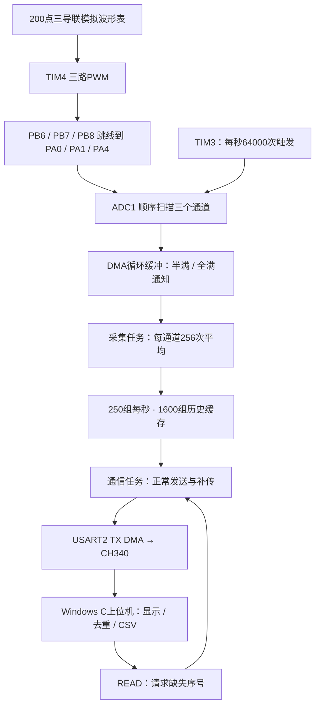

STM32F103 ECG · FreeRTOS

**用一块 STM32F103 最小系统板，跑通三通道采集、实时显示与丢包补传。**

固件、Windows 上位机和测试均使用 C。通过 PWM 跳线构造三导联模拟信号，再由真实 ADC 扫描采集，展示一个数据采集系统从“采得到”到“丢了还能补”的完整过程。

**实板验证：主动丢弃 5 秒接收数据后，3975 组记录全部补齐，过期、ADC 故障、RX 错误及解析错误均为 0。** 测试条件与原始记录见 [验证报告](docs/validation.md)。

[快速开始](#快速开始) · [应用场景](#适合用在哪里) · [学习文档](docs/从零读懂项目.md) · [测试记录](docs/board_test.json)

> 这是三导联模拟采集实验，不是人体心电采集设备。无需 ADS1293 或 RC 滤波器；模拟信号从 PWM 引脚通过跳线进入 ADC，禁止将人体电极直接连接到本板。

## 你能用它做什么

- **看到完整的数据流**：定时器触发 → ADC 三通道扫描 → DMA → FreeRTOS 任务 → 串口 → C 语言波形窗口。
- **亲手制造一次断传**：上位机提供“丢弃接收5秒”按钮，恢复后按序号找缺口、请求补传、去重，并统计无法恢复的历史。
- **观察任务是否按设计运行**：显示实际任务优先级、栈历史最小剩余空间、采集通知唤醒延迟及处理耗时。
- **保存数据继续分析**：导出三通道 ADC 平均码的 CSV，记录会话和序号。
- **从源码学会设计理由**：附中文教程，解释为何半满中断处理、如何安排优先级、为什么有 CRC 还需要序号，以及缓存过期后怎么办。

工程没有 Python 或 Qt 运行依赖，所需 FreeRTOS 内核源码随仓库提供。应用代码为 C，处理器启动和任务切换包含必要汇编，构建与烧录脚本使用 PowerShell。

## 适合用在哪里

| 场景 | 可以直接学习或复用的部分 | 适用边界 |
|---|---|---|
| FreeRTOS 课程与实验 | 静态任务、抢占调度、中断通知、栈余量观测 | 可按教程观察和修改，不必先准备模拟前端 |
| 多通道传感器采集原型 | ADC 扫描、DMA 半区处理、历史缓存、串口协议 | 更换信号源后需重新核算输入范围、采样时间与滤波 |
| 短时通信中断实验 | 序号检测、选择性补传、超时重试、重复包过滤 | 保持板子供电；恢复能力受缓存与吞吐限制 |
| 心电算法的数据链路教学 | 三导联模拟波形、采集显示、CSV 数据导出 | 不是临床数据，不用于验证医疗算法准确性 |
| 嵌入式作品集与面试讲解 | 可运行源码、资源预算、错误处理和实板证据 | 适合围绕自己的复现与修改展开，不承诺面试结果 |

如果你正在做温度、电流或其他低速传感器采集，可以从历史缓存和协议开始复用；如果关注 RTOS，可以先看任务与 DMA 的协作。波形源只是入口，项目重点是后面的采集与传输设计。

## 数据是怎么走的



一个 DMA 半区包含 `256 × 3` 个原始值，约 4 ms 填满。采集任务分别平均，得到一组三通道记录；通常积累 25 组后组成一个 168 字节 DATA 帧，约 100 ms 发送一次。

**ADC1 依次扫描三个输入，不是三路同时采样。** 无 RC 时 ADC 采到的是 PWM 高低电平，数字平均估计占空比对应的平均值；12 位 ADC 位宽不代表本系统具有 12 位有效精度。

## 快速开始

### 1. 下载源码

使用仓库页面的 **Code → Download ZIP**，或者：

```bash
git clone https://github.com/smalltownkeed/stm32f103-ecg-freertos.git
```

进入包含 `README.md`、`firmware/` 和 `tools/` 的项目目录。源码不包含 `build/` 中的可执行文件，需先完成下方构建。

### 2. 准备硬件与接线

- STM32F103C8T6 最小系统板，板载 **8 MHz HSE 晶振**。
- ST-Link，用于下载和调试。
- CH340 或兼容 USB 转串口模块，UART 逻辑电平为 **3.3 V**。
- 杜邦线；Windows 电脑。

| 板端引脚 | 连接到 | 用途 |
|---|---|---|
| PB6 | PA0 | 模拟 I 路 → ADC IN0 |
| PB7 | PA1 | 模拟 II 路 → ADC IN1 |
| PB8 | PA4 | 模拟 III 路 → ADC IN4 |
| PA2 | USB串口模块 RX | 板子发送 |
| PA3 | USB串口模块 TX | 板子接收 |
| GND | USB串口模块 GND | 共地 |
| PA13 / PA14 | ST-Link SWDIO / SWCLK | 下载与调试，地线共地 |

按板卡和 ST-Link 说明正确供电，避免多个电源输出相连。三路 PWM 跳线不占用 PA2/PA3，串口可以同时工作。

### 3. 构建

需要 GNU Arm Embedded GCC、Windows 原生 MinGW GCC 和 PowerShell；烧录另需 OpenOCD。以下路径是示例，请替换为实际安装位置：

```powershell
$env:ARM_GCC_BIN = 'C:/Tools/arm-gnu-toolchain/bin'
$env:NATIVE_GCC_BIN = 'C:/Tools/mingw64/bin'
$env:OPENOCD_ROOT = 'C:/Tools/openocd'

# 构建固件、上位机和测试，自动运行本机C测试
.\tools\build.ps1
```

也支持 `-ArmBin`、`-NativeBin` 参数；只构建固件可加 `-FirmwareOnly`。已验证的构建工具版本与资源占用见 [验证报告](docs/validation.md)。

### 4. 烧录并打开波形窗口

```powershell
# 下载、校验、复位，会覆盖板上现有程序
.\tools\flash.ps1

# 使用自己的串口号；COM7只是示例
.\build\ecg_viewer.exe COM7
```

固件输出为 `build/ecg_freertos.hex`，BIN 下载地址为 `0x08000000`，ELF 可用于调试。使用 ST-Link 下载不需要把 BOOT0 改为 1。

也可以运行上位机后选择端口并连接。`start_viewer.cmd` 默认连接 COM7。只有一个程序能占用该串口，运行实板测试前请关闭波形窗口。

### 5. 做一次5秒断传实验

1. 正常连接，确认有三路波形和任务统计。
2. 点击“丢弃接收5秒”。板子继续采集，电脑实际读取后丢弃字节。
3. 等待接收恢复，观察缺口补传。
4. 同时检查 **missing 和 expired**；missing 为 0 不代表过期的数据也已补回。

若要得到机器可读的验收结果，关闭上位机后运行：

```powershell
.\build\board_test.exe COM7
```

测试持续约16秒，包含5秒主动丢弃接收。CSV需连接后开启，断开或重新连接会关闭记录；补传记录按到达顺序追加，分析时按 `session, seq` 排序。

## 为何这样设计

### 采集不能等串口

| FreeRTOS任务 | 优先级 | 等待方式 | 职责 |
|---|---:|---|---|
| `adc` | 4 | 等待DMA通知 | 检查半区、三通道平均、写历史、更新PWM |
| `comm` | 2 | 每轮阻塞1ms | 解析命令、调度实时包和补传 |
| `monitor` | 1 | 500ms周期 | 心跳与任务运行统计 |
| `Idle` | 0 | 无其他任务就绪 | 内核空闲任务 |

DMA中断只交接半区信息并通知任务。采集任务在平均前后检查代数和DMA位置，发现覆盖或源头采集故障就停采并报告，避免输出看似连续的错误数据。

所有任务栈与TCB静态分配，不使用RTOS动态堆。通信任务独占发送缓冲，DMA发送完成后才能重用。

### 让短临界区保护数据，让高紧迫度UART及时接收

任务优先级数字越大越优先，NVIC中断优先级数字越小越优先，两者不能直接比较。

本工程UART RX的NVIC优先级为4，不调用FreeRTOS API；ADC DMA为5，使用FromISR通知；TX DMA为6；SysTick/PendSV为15。内核API中断阈值为 `5 << 4`。

通信任务每次只在短临界区内复制一组三通道记录，不一次锁住整包。UART RX仍可响应，并将字节放入单生产者/单消费者接收环形缓冲。

### 发过的数据，仍保留一段时间

1600组历史占9600字节，对应6.4秒采样记录。发送不会删除历史，新的采样按序覆盖最旧记录。

电脑通过序号识别缺口，每次请求最多25组，100ms未收齐则重试；重复数据去重，已过期历史返回GAP。通信调度顺序为STATUS、DIAG、实时数据、补传，因此实时数据优先于补传。

**6.4秒是缓存容量，不是任意情况下保证恢复的断传时长。** 请求延迟、恢复吞吐和重试都会消耗余量；掉电或复位会丢失RAM历史。

## 测过什么

| 测试 | 已有结果与覆盖 |
|---|---|
| 本机C协议测试 | 已知CRC、小端编码、坏包后重新同步、非法包形状 |
| 平均与历史缓存测试 | 三通道平均、环绕、过期与未来序号 |
| 本机恢复测试 | 6000组数据，模拟5秒断传及重复丢包，逐条核对三通道值并去重 |
| 实板断传测试 | 3975 / 3975组；missing=0，expired=0；ADC/RX/解析错误为0 |
| 任务观测 | 实际优先级4/2/1；已记录栈余量和采集耗时 |

实板测试保持供电，主动丢弃电脑接收字节，不代表断电恢复或所有物理链路故障。当前未完成长期老化与所有故障模式测试。发布目录重构建与此前实板构建的区别、资源占用及原始测量条件均记录在 [验证报告](docs/validation.md)。

## 从哪里读代码

**第一次接触这个项目，先读 [《从零读懂项目》](docs/从零读懂项目.md)。** 教程包含时序计算、逐步补传示例、关键函数和可操作的实验。

| 你想理解什么 | 从这里开始 |
|---|---|
| 三个任务怎样运行 | [firmware/app.c](firmware/app.c) |
| ADC、定时器、DMA怎样配置 | [firmware/board.c](firmware/board.c) |
| FreeRTOS优先级和内存配置 | [firmware/FreeRTOSConfig.h](firmware/FreeRTOSConfig.h) |
| 256次平均和1600组历史 | [common/history.c](common/history.c) |
| 帧头、长度、CRC及解析 | [common/protocol.c](common/protocol.c) |
| 电脑如何发现缺口、去重和补传 | [host/receiver.c](host/receiver.c) |
| 串口连接、CSV与断传模拟 | [host/session.c](host/session.c) |
| Windows原生波形界面 | [host/viewer.c](host/viewer.c) |
| 如何编写可重复的恢复测试 | [tests/test_core.c](tests/test_core.c) |

协议包含DATA、STATUS、GAP、DIAG及READ、HELLO、BIND；采用显式小端编码和CRC16。会话号用于区分连接，不用于认证。详细字段见 [设计说明](docs/design.md)。

## 一起改进

欢迎提交复现记录、问题报告或Pull Request。反馈问题时，请附上板卡型号、接线、工具版本、复现步骤和错误计数；能够复现的问题比单独一张异常波形更容易定位。

可讨论的扩展方向：采样率与通道数参数化、长时间断传压力测试、跨平台上位机、非易失历史存储、带合适模拟前端的真实传感器输入。这些是后续方向，不是当前已实现的功能。

如果这个项目帮你理解了ADC/DMA、FreeRTOS或丢包恢复，欢迎点一个 **Star**，也方便以后找到它；如果你做了移植或课堂实验，欢迎分享你的结果。

## 许可证

应用代码采用 [MIT License](LICENSE)。随仓库提供的 FreeRTOS Kernel **V10.3.1** 保留原始源码与 [第三方许可证](third_party/FreeRTOS/LICENSE)。引用或分发时请保留相关版权及许可声明。
